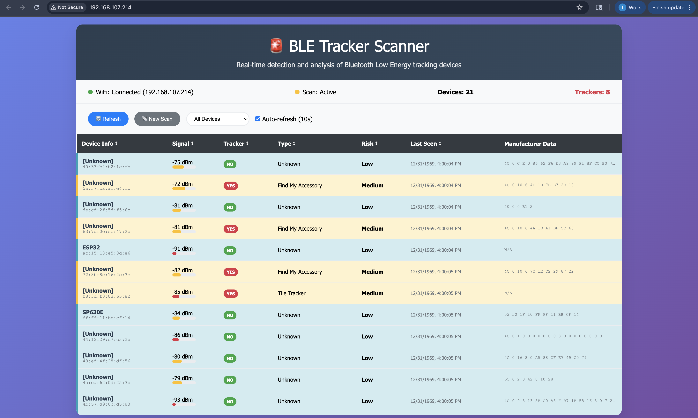

# BLE Tracker Scanner

A real-time Bluetooth Low Energy (BLE) tracker detection system built on ESP32 that identifies and analyzes potential tracking devices like AirTags, Tile trackers, and other BLE-based location trackers.



## 🚨 Features

- **Real-time BLE Device Detection**: Continuously scans for nearby Bluetooth Low Energy devices
- **Tracker Classification**: Intelligently identifies potential tracking devices including:
  - Apple AirTags (Offline Finding & Status modes)
  - Apple Find My network accessories
  - Tile Bluetooth trackers
  - Samsung Galaxy SmartTags
  - OpenHaystack DIY trackers
- **Risk Assessment**: Categorizes devices by risk level (High, Medium, Low)
- **Web Interface**: Modern, responsive web dashboard accessible from any device
- **Real-time Updates**: Auto-refreshing interface with live device status
- **Signal Strength Analysis**: RSSI monitoring with visual indicators
- **Device Filtering**: Filter by tracker status, risk level, or view all devices
- **Manufacturer Data Analysis**: Detailed examination of BLE advertisement data

## 🛠️ Hardware Requirements

- **ESP32 Development Board** (tested with Denky32)
- **WiFi Connection** for web interface access
- **Power Supply** (USB or battery)

## 📋 Software Dependencies

- **PlatformIO** development environment
- **ESP32 Arduino Framework**
- **Libraries** (automatically installed via PlatformIO):
  - ESP32 BLE Arduino
  - ESPAsyncWebServer
  - ArduinoJson
  - AsyncTCP

## 🚀 Installation & Setup

### 1. Clone the Repository
```bash
git clone https://github.com/jl-codes/gps-tracker-detector.git
cd gps-tracker-detector
```

### 2. Configure WiFi Credentials
Edit `src/main.cpp` and update the WiFi credentials:
```cpp
const char* ssid = "YOUR_WIFI_SSID";
const char* password = "YOUR_WIFI_PASSWORD";
```

### 3. Build and Upload
Using PlatformIO:
```bash
# Build the project
pio run

# Upload to ESP32
pio run --target upload

# Monitor serial output
pio device monitor
```

### 4. Access Web Interface
1. Open the Serial Monitor to find the ESP32's IP address
2. Navigate to `http://[ESP32_IP_ADDRESS]` in your web browser
3. The scanner will automatically begin detecting BLE devices

## 🖥️ Web Interface

The web dashboard provides:

- **Status Bar**: WiFi connection, scan status, device counts
- **Control Panel**: Manual refresh, new scan trigger, device filtering
- **Device Table**: Comprehensive list of detected devices with:
  - Device name and MAC address
  - Signal strength (RSSI) with visual bars
  - Tracker classification (YES/NO badges)
  - Device type and risk assessment
  - Last seen timestamp
  - Raw manufacturer data

### Interface Features

- **Auto-refresh**: Updates every 10 seconds (configurable)
- **Sorting**: Click column headers to sort data
- **Filtering**: View all devices, trackers only, or by risk level
- **Risk Highlighting**: Color-coded rows for different risk levels
- **Mobile Responsive**: Works on smartphones and tablets

## 🔍 Detection Algorithms

### Apple AirTag Detection
- **Offline Finding Mode** (Type 0x12, Subtype 0x19): High risk
- **Status Advertisement** (Type 0x12, Subtype 0x02): Medium risk
- **Find My Accessories** (Type 0x10): Medium risk

### Other Tracker Detection
- **Tile Trackers**: Service UUID `0000feed-0000-1000-8000-00805f9b34fb`
- **Samsung SmartTags**: Manufacturer data pattern matching
- **OpenHaystack**: Custom service UUID detection
- **Named Devices**: Pattern matching for tracker names

### False Positive Prevention
- Excludes fitness trackers (Fitbit, Garmin, etc.)
- Avoids common Apple Continuity/Handoff advertisements
- Requires specific data patterns for classification

## 📊 Serial Output

The device provides detailed serial logging including:
- Device discovery notifications
- Tracker classification results
- Signal strength measurements
- Manufacturer data analysis
- Risk assessments and warnings

## ⚙️ Configuration

### Scan Parameters
```cpp
#define SCAN_TIME 5        // Duration of each scan (seconds)
#define SCAN_INTERVAL 1000 // Interval between scans (milliseconds)
#define MAX_DEVICES 50     // Maximum stored devices
```

### BLE Scanner Settings
- **Active Scan**: Enabled for maximum device information
- **Scan Interval**: 100ms
- **Scan Window**: 99ms

## 🔒 Privacy & Security

- **Local Processing**: All analysis performed on-device
- **No Data Transmission**: Device data stays on your local network
- **Open Source**: Full transparency of detection algorithms
- **WiFi Only**: No internet connection required for operation

## 🚨 Use Cases

- **Personal Security**: Detect unwanted tracking devices
- **Privacy Auditing**: Monitor BLE environment for trackers
- **Research**: Study BLE advertisement patterns
- **Education**: Learn about BLE security and privacy

## 📱 API Endpoints

The ESP32 provides REST API endpoints:

- `GET /api/devices` - Retrieve all detected devices
- `GET /api/status` - System status information
- `POST /api/scan` - Trigger manual scan

## 🛡️ Limitations

- **Detection Range**: Limited to BLE transmission range (~10-30 meters)
- **Battery Impact**: Continuous scanning affects ESP32 battery life
- **False Negatives**: Some trackers may use advanced evasion techniques
- **Network Dependency**: Web interface requires WiFi connection

## 🤝 Contributing

Contributions are welcome! Areas for improvement:
- Additional tracker detection algorithms
- Enhanced web interface features
- Mobile app development
- Battery optimization
- New device support

## 📄 License

This project is open source. Please check the repository for license details.

## ⚠️ Disclaimer

This tool is for educational and privacy protection purposes. Users are responsible for complying with local laws and regulations regarding BLE scanning and privacy.

---

**Built with ESP32 • PlatformIO • Modern Web Technologies**
